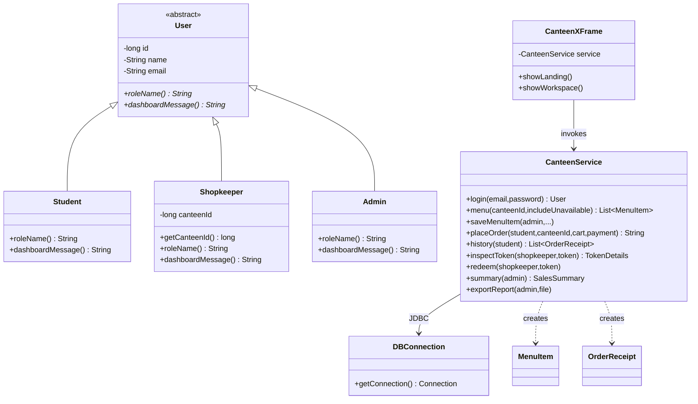

# CanteenX class diagram

```mermaid
classDiagram
  class User {
    <<abstract>>
    -long id
    -String name
    -String email
    +roleName()* String
    +dashboardMessage()* String
  }
  class Student {
    +roleName() String
    +dashboardMessage() String
  }
  class Shopkeeper {
    -long canteenId
    +getCanteenId() long
    +roleName() String
    +dashboardMessage() String
  }
  class Admin {
    +roleName() String
    +dashboardMessage() String
  }
  User <|-- Student
  User <|-- Shopkeeper
  User <|-- Admin
  class CanteenService {
    +login(email,password) User
    +menu(canteenId,includeUnavailable) List~MenuItem~
    +saveMenuItem(admin,...)
    +placeOrder(student,canteenId,cart,payment) String
    +history(student) List~OrderReceipt~
    +inspectToken(shopkeeper,token) TokenDetails
    +redeem(shopkeeper,token)
    +summary(admin) SalesSummary
    +exportReport(admin,file)
  }
  class DBConnection {
    +getConnection() Connection
  }
  class CanteenXFrame {
    -CanteenService service
    +showLanding()
    +showWorkspace()
  }
  CanteenXFrame --> CanteenService : invokes
  CanteenService --> DBConnection : JDBC
  CanteenService ..> MenuItem : creates
  CanteenService ..> OrderReceipt : creates
```
